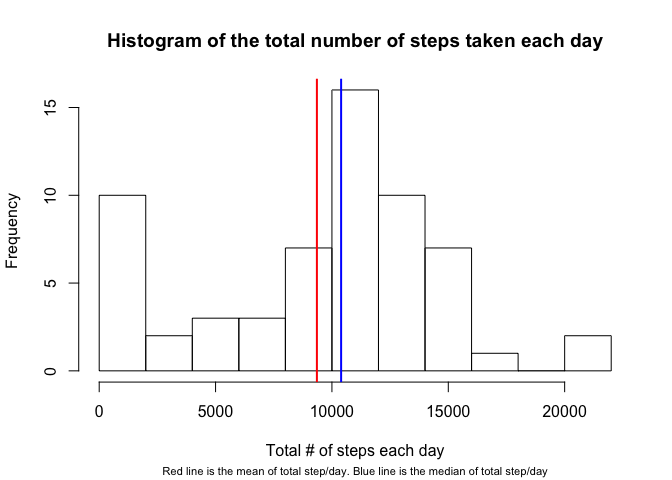
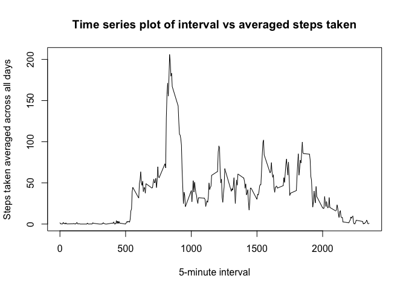
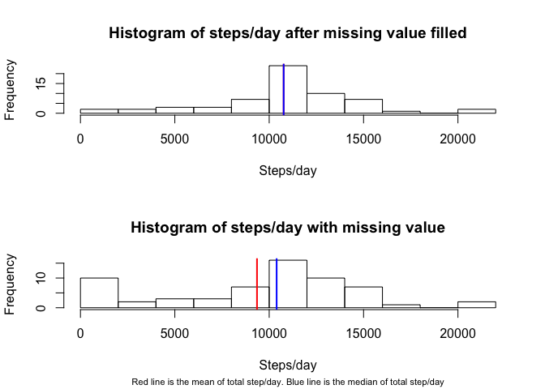
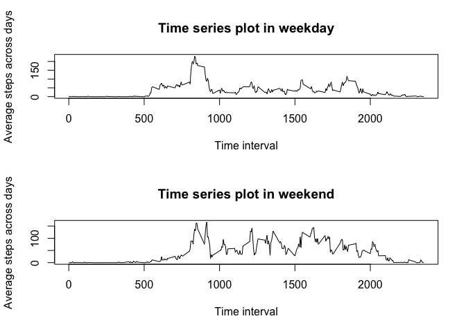

# Reproducible Research: Peer Assessment 1


## Loading and preprocessing the data  

```r
act <- read.csv(unzip("activity.zip"), stringsAsFactors=FALSE)
str(act)
```

```
## 'data.frame':	17568 obs. of  3 variables:
##  $ steps   : int  NA NA NA NA NA NA NA NA NA NA ...
##  $ date    : chr  "2012-10-01" "2012-10-01" "2012-10-01" "2012-10-01" ...
##  $ interval: int  0 5 10 15 20 25 30 35 40 45 ...
```

```r
head(act)
```

```
##   steps       date interval
## 1    NA 2012-10-01        0
## 2    NA 2012-10-01        5
## 3    NA 2012-10-01       10
## 4    NA 2012-10-01       15
## 5    NA 2012-10-01       20
## 6    NA 2012-10-01       25
```

## What is mean total number of steps taken per day?  
1. Calculate the total number of steps taken per day, and put result into a data frame.    

```r
sm <- tapply(act$steps, act$date, sum, na.rm=TRUE)
tt <- data.frame(date = names(sm),steps = sm)
```

2. Make a histogram of the total number of steps taken each day  

```r
hist(tt$steps, breaks = 10, xlab = "Total # of steps each day", main="Histogram of the total number of steps taken each day")
abline(v= mean(tt$steps), col="red", lwd = 2)
abline(v=median(tt$steps), col="blue", lwd = 2)
mtext("Red line is the mean of total step/day. Blue line is the median of total step/day",side=1, line=4,cex=0.7)
```



3. Calculate and report the mean and median of the total number of steps taken per day  

```r
mean(tt$steps)
```

```
## [1] 9354.23
```

```r
median(tt$steps)
```

```
## [1] 10395
```

Mean and Median of the total number of steps taken per day are 9354.23 and 10395 seperately.

## What is the average daily activity pattern?
1. Make a time series plot of the 5-minute interval (x-axis) and the average number of steps taken, averaged across all days (y-axis)  

```r
am <- tapply(act$steps, act$interval, mean, na.rm=TRUE)
dam <- data.frame(interval=as.numeric(names(am)), step=am)
plot(dam$interval, dam$step, type="l", xlab="5-minute interval", ylab="Steps taken averaged across all days", main="Time series plot of interval vs averaged steps taken")
```



```r
dam[which.max(dam$step),"interval"]
```

```
## [1] 835
```

The #835 time interval gives largest average steps.

## Imputing missing values  
1. total number of missing values in the dataset is:

```r
sum(is.na(act$steps))
```

```
## [1] 2304
```

2. Use the mean of that 5 mins interval to fill in missing value  

```r
act1 <- merge(act, dam, by="interval")
act1$stepfill<- ifelse(!is.na(act1$steps), act1$steps, act1$step)
actfill <- act1[,c("stepfill","date","interval")]
```

4. Make a histogram of the total number of steps taken each day and Calculate and report the mean and median total number of steps taken per day. Do these values differ from the estimates from the first part of the assignment? What is the impact of imputing missing data on the estimates of the total daily number of steps?

```r
tt_fill <- tapply(actfill$stepfill, actfill$date, sum)
#pdf("graph1")
par(mfrow=c(2,1))
hist(tt_fill,breaks=10, main = "Histogram of steps/day after missing value filled", xlab="Steps/day")
abline(v= mean(tt_fill,na.rm=TRUE), col="red", lwd = 2)
abline(v=median(tt_fill, na.rm=TRUE), col="blue", lwd = 2)
hist(tt$steps, breaks=10,xlab = "Steps/day", main="Histogram of steps/day with missing value")
abline(v= mean(tt$steps), col="red", lwd = 2)
abline(v=median(tt$steps), col="blue", lwd = 2)
mtext("Red line is the mean of total step/day. Blue line is the median of total step/day",side=1, line=4,cex=0.7)
```



From the graph, we see that after filling in missing value, both mean(from 9354.23 to 10766.19) and median(from 10395 to 10766.19) increased.   

## Are there differences in activity patterns between weekdays and weekends?

```r
actfill$weekday <- weekdays(as.POSIXct(actfill$date))
actfill <- actfill[order(actfill$date),]
actfill$wtype <- ifelse(actfill$weekday %in% c("Saturday","Sunday"),"Weekend","Weekday")
par(mfrow=c(2,1))
wkday <- with(subset(actfill, wtype=="Weekday"), tapply(stepfill, interval, mean))
wkend <- with(subset(actfill, wtype=="Weekend"), tapply(stepfill, interval, mean)) 

plot(names(wkday), wkday, type="l", xlab="Time interval", ylab="Average steps across days", main="Time series plot in weekday")
plot(names(wkend), wkend, type="l", xlab="Time interval", ylab="Average steps across days", main="Time series plot in weekend")
```



From the graph, we see that weekend intervals tends to have more steps.

